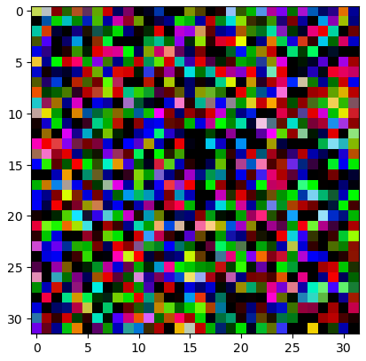
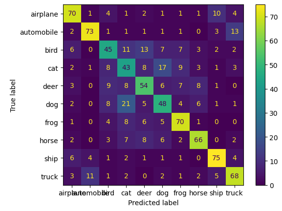
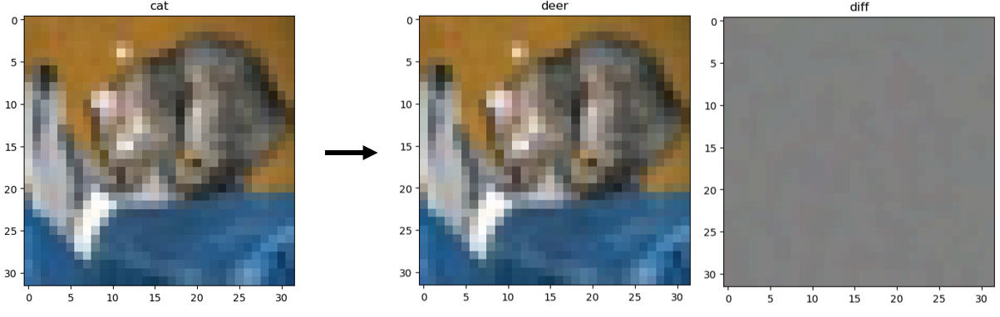
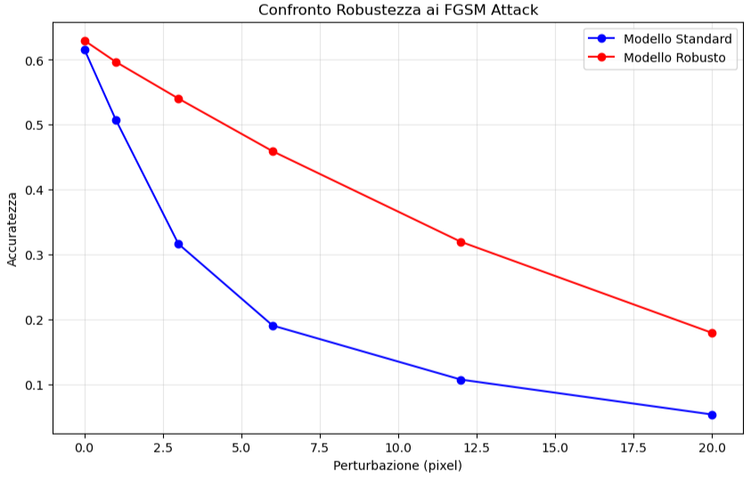
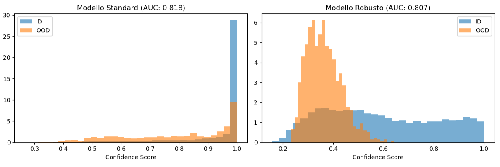
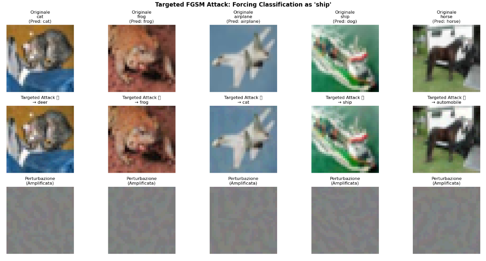
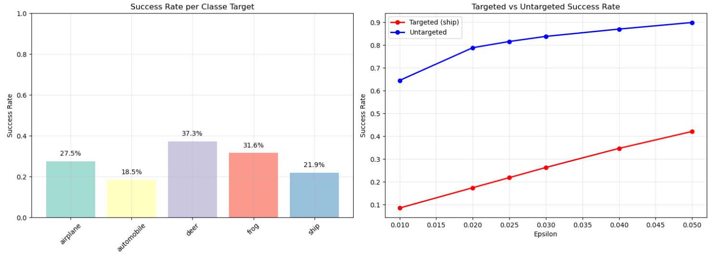

# Lab 4: Out-of-Distribution Detection & Adversarial Robustness

Tecniche di Out-of-Distribution detection tramite Maximum Softmax Probability e Autoencoder, analisi di attacchi avversariali FGSM e valutazione delle metriche ROC/PR.

## 📁 Contenuti

- `Lab4-OOD-2025.ipynb` - Notebook principale con OOD detection e adversarial attacks
- `cfar10_CNN_50_0.0001.pth` - Modello CNN addestrato su CIFAR-10 (18.6 KB)
- `robust_model.pth` - Modello robusto contro attacchi adversarial (8.6 MB)
- `images/` - Cartella contenente visualizzazioni e grafici generati

## 🎯 Obiettivi del Laboratorio

1. **OOD Detection Pipeline**: Implementazione di sistemi per rilevare campioni out-of-distribution
2. **Metriche di Valutazione**: AUC-ROC e Precision-Recall per performance assessment
3. **Adversarial Attacks**: Generazione e analisi di attacchi FGSM mirati e non
4. **Robustezza**: Tecniche per migliorare la resistenza agli attacchi adversarial

## 🚀 Setup Ambiente

Attiva l'ambiente conda specifico per questo lab:

```bash
conda activate transformers
# oppure se non hai l'ambiente:
conda env create -f ../environment-transformers.yml
conda activate transformers
```

## 📊 Risultati Sperimentali

### Exercise 1: OOD Detection Pipeline & Performance Evaluation

#### 1.1 Setup e Dataset

**Dataset Configuration:**
- **In-Distribution (ID)**: CIFAR-10 (10 classi standard)
- **Out-of-Distribution (OOD)**: FakeData (rumore casuale)
- **Modello Base**: CNN con accuracy 61.6% su CIFAR-10



**FakeData Characteristics**: Immagini di rumore casuale puro che non assomigliano a nessuna classe CIFAR-10, utilizzate come perfetto esempio di distribuzione sconosciuta.



**Model Baseline Performance**: Il modello mostra pattern tipici con confusioni tra categorie simili (animali tra loro, veicoli tra loro). Performance migliori su Ship (75%), Frog (70%), Horse (66%).

#### 1.2 OOD Detection Methods & Results

**Metodi Implementati:**
- **Maximum Logit**: Utilizzo della confidenza massima come score OOD
- **Autoencoder**: Errore di ricostruzione come indicatore di anomalia

**Performance Quantitative:**

| Metodo          | AUC-ROC | AUC-PR | Average Precision | Efficacia                    |
|-----------------|---------|--------|-------------------|------------------------------|
| **Maximum Logit** | **0.9511** | **0.9950** | **1.00** | Separazione netta, threshold definibile |
| **Autoencoder**   | 0.9419  | 0.9946  | 0.99  | Buone performance, ma overlap problematico |

**Key Findings:**
- **Maximum Logit**: Dimostra separazione netta tra ID (score ~110) e OOD (score ~20) con overlap minimo
- **Autoencoder**: Performance competitive ma overlap significativo nelle distribuzioni rende la threshold selection più critica
- **Practical Impact**: Maximum logit risulta più robusto e facilmente implementabile per applicazioni reali

### Exercise 2: Adversarial Attacks & Robustness Enhancement

#### 2.1 FGSM Implementation & Adversarial Examples

**Fast Gradient Sign Method (FGSM):**
- Formula: η(x) = ε · sign(∇ₓ L(θ, x, y))
- **Target Attack**: Trasformazione cat → deer con perturbazione minima
- **Budget**: 5/255 (praticamente invisibile all'occhio umano)



**Risultati Attacco:**
- **Successo in 5 iterazioni**: Attacco targeted completato rapidamente
- **Perturbazione selettiva**: Modifiche strategiche, non rumore casuale
- **Gap critico**: Differenza tra percezione umana e artificiale evidenziata

#### 2.2 Adversarial Training & Robustness Evaluation

**Strategia Adversarial Training:**
- Augmentazione on-the-fly con esempi adversarial FGSM
- Training con mix di campioni clean e adversarial
- Valutazione robustezza vs OOD detection capability



**Performance Robustezza:**

| Metrica                    | Standard Model | Robust Model | Miglioramento |
|----------------------------|----------------|--------------|---------------|
| **Accuracy Clean**        | 0.616          | 0.630        | +0.014        |
| **Robustezza (max attack)**| 0.054          | 0.179        | **+0.126**    |
| **AUC OOD Detection**      | 0.818          | 0.807        | -0.012        |



**Analisi Distribuzione Confidence:**
- **Modello Standard**: Overconfident, score alti anche per OOD
- **Modello Robusto**: Distribuzione più bilanciata, separazione ID/OOD migliorata
- **Beneficio**: Riduzione overconfidence, maggiore affidabilità nelle predizioni

### Exercise 3: Targeted Adversarial Attacks Analysis

#### 3.1 Targeted FGSM Implementation

**Metodologia Targeted Attack:**
- **Target**: Forzare classificazione verso classe specifica ("ship")
- **Formula**: η(x) = ε · sign(∇ₓ L(θ, x, y_target))
- **Obiettivo**: Manipolazione controllata invece di confusione generica



**Osservazioni Qualitative:**
- **Perturbazioni invisibili**: ε = 0.03 produce modifiche impercettibili
- **Success rate variabile**: Solo 20% successo su 5 esempi testati
- **Errori preesistenti**: Alcuni attacchi "correggono" classificazioni già errate del modello (dimostra che il modello base non è perfetto - 61% di accuracy, è quasi un paradosso ovevro l'attacco avversario "corregge", trasforma una classificaizone errata in una corretta, es: ship nell'immagine)

#### 3.2 Quantitative Analysis & Class Vulnerability



**Vulnerabilità per Classe Target (ε = 0.025):**

| Classe Target | Success Rate | Categoria    |
|---------------|--------------|--------------|
| **Deer**      | **37.3%**    | Più vulnerabile |
| **Frog**      | 31.6%        | Vulnerabile  |
| **Airplane**  | 27.5%        | Moderata     |
| **Ship**      | 21.9%        | Resistente   |
| **Automobile**| **18.5%**    | Più resistente |

**Confronto Targeted vs Untargeted (ε = 0.050):**

| Tipo Attacco  | Success Rate | Differenza |
|---------------|--------------|------------|
| **Untargeted**| **89.9%**    | baseline   |
| **Targeted**  | 42.1%        | **-47.8%** |

**Key Insights:**
- **Attacchi targeted significativamente più difficili**: Gap costante ~50-60% su tutti i valori di ε
- **Variabilità classe-specifica**: Deer più vulnerabile, Automobile più resistente
- **Crescita monotona**: Entrambi i tipi di attacco migliorano con ε crescente, ma con pendenze diverse

## 🔍 Conclusioni Finali

### Exercise 1 - OOD Detection
- **Maximum Logit superiore** all'Autoencoder per separazione netta e threshold facilmente definibile
- **Performance eccellenti** (AUC > 0.94) per entrambi i metodi su scenario CIFAR-10 vs FakeData

### Exercise 2 - Adversarial Robustness  
- **FGSM efficace** nel generare attacchi con perturbazioni minime ma visivamente impercettibili
- **Adversarial training** migliora significativamente robustezza (+0.126) mantenendo accuracy clean
- **Trade-off accettabile**: leggero calo OOD detection (-0.012) ma beneficio nella riduzione overconfidence

### Exercise 3 - Targeted Attacks
- **Attacchi targeted significativamente più difficili** degli untargeted (~50% gap in success rate)
- **Vulnerabilità classe-specifica**: Deer più vulnerabile (37.3%), Automobile più resistente (18.5%)
- **Perturbazioni selettive**: Richiesto maggiore budget ε per efficacia, dimostrando robustezza relativa del modello

## 🎯 Key Insights del Laboratorio

1. **OOD Detection**: Maximum logit emerge come soluzione pratica ed efficace
2. **Adversarial Vulnerability**: Anche modelli ben addestrati sono vulnerabili ad attacchi sofisticati  
3. **Robustness vs Performance**: Adversarial training offre compromesso intelligente tra sicurezza e performance
4. **Attack Complexity**: Gli attacchi mirati richiedono precisione maggiore, evidenziando la struttura delle rappresentazioni apprese

**Implicazione Pratica**: È possibile sviluppare modelli più sicuri contro attacchi avversari mantenendo capacità di rilevamento anomalie.
## 💻 Esecuzione

1. Assicurati di avere l'ambiente `transformers` attivato
2. Apri il notebook: `jupyter lab Lab4-OOD-2025.ipynb`
3. Esegui le celle in sequenza per:
   - Training del modello base su CIFAR-10
   - Implementazione OOD detection methods
   - Generazione attacchi FGSM e adversarial training
   - Analisi attacchi targeted e confronti quantitativi

## 📋 Dataset

- **CIFAR-10**: Scaricato automaticamente tramite torchvision
- **FakeData**: Generato programmaticamente (rumore casuale)
- **Preprocessing**: Normalizzazione standard per compatibilità con modelli pre-addestrati

## ⚠️ Note Tecniche

- **GPU Raccomandabile**: Per training efficiente dei modelli
- **RAM**: Minimo 8GB per gestire dataset e modelli
- **Storage**: I modelli salvati occupano ~10MB totali

---

**Corso**: Deep Learning Applications \
**Autore**: Leonardo Biondi   
**Anno Accademico**: 2024-2025